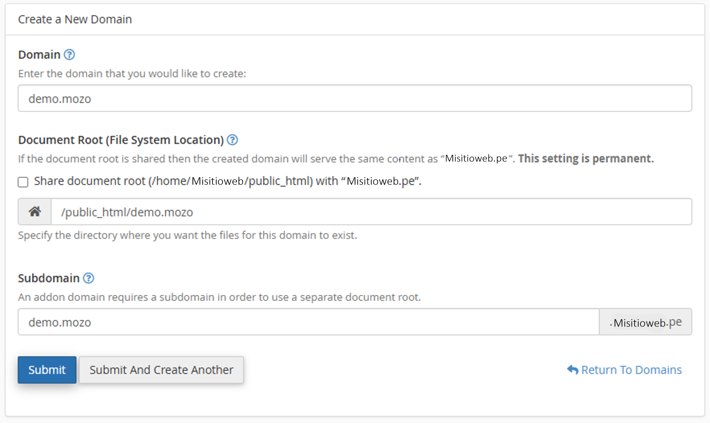
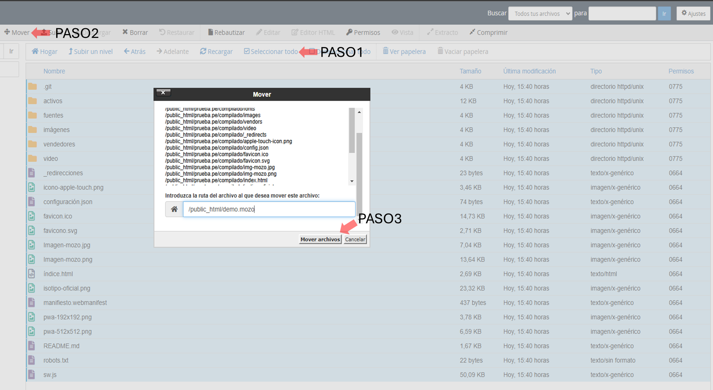
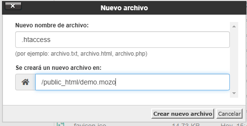
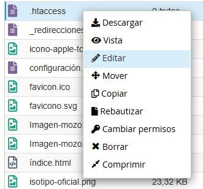

# Instalación de Mozo en cPanel

## Requisitos Previos
- **[Compilado-Mozo](https://gitlab.buho.la/mozo/compilado)**.
- Acceso a cuenta cPanel con privilegios de administrador.

## Proceso de Instalación Paso a Paso

### 1. Creación del Dominio

1. Acceder a cPanel.
2. Navegar a **Dominios > Crear un Nuevo Dominio**.
3. En la interfaz de creación:
   - Ingresar el nombre del dominio.
   - **IMPORTANTE**: Desmarcar la casilla.
   - Agregar `public_html/` en el campo de nombre de carpeta.



:::caution
> **NOTA**: Es fundamental desmarcar la casilla y agregar **public_html/** en el nombre de su carpeta.
:::

### 2. Conexión SSH a cPanel

#### 2.1 Obtener Credenciales
1. Localizar el **Usuario** y la **Dirección IP** de su cPanel.
   

:::tip
> **IMPORTANTE**: El Usuario es el mismo con el que ingresas a cPanel.
:::

#### 2.2 Establecer Conexión
1. Abrir terminal o símbolo del sistema (cmd).
2. Ejecutar el comando SSH:
   ```bash
   ssh [Usuario]@[DirecciónIP]
   ```
   Ejemplo:
   ```bash
   ssh Misitioweb@192.246.230.120
   ```

   

#### 2.3 Navegar al Directorio
1. Acceder a la carpeta del dominio:
   ```bash
   cd public_html/demo.mozo
   ```

   

### 3. Instalación del Compilado

1. Clonar el repositorio de Mozo:
   ```bash
   git clone https://gitlab.buho.la/mozo/compilado.git
   ```
2. Ingresar las credenciales de GitLab cuando se soliciten.

   

### 4. Configuración Post-Instalación

#### 4.1 Organización de Archivos
1. En cPanel, navegar a la sección de Dominios.
2. Acceder a la ruta del dominio.
3. Mover todo el contenido de la carpeta `compilado` al directorio raíz.

   

:::tip
> **TIP**: Puede eliminar la carpeta `compilado` una vez esté vacía.
:::

#### 4.2 Configuración del .htaccess
1. Crear nuevo archivo `.htaccess`.

   
2. Editar y agregar la siguiente configuración:
  
  
   ```apache
      # Archivo necesario cuando publiques la app en apache y que funcione el SPA
      <IfModule mod_rewrite.c>
      RewriteEngine On

          # Condición: si el archivo o directorio solicitado no existe
          RewriteCond %{REQUEST_FILENAME} !-f
          RewriteCond %{REQUEST_FILENAME} !-d

          # Redirigir todas las peticiones al index.html
          RewriteRule ^ index.html [L]
      </IfModule>
   ```

#### 4.3 Configuración del config.json
1. Abrir el archivo `config.json`.
2. Verificar que la ruta principal esté correctamente configurada.

   
3. Guardar los cambios realizados y salir.

