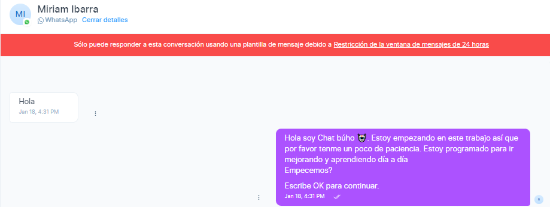
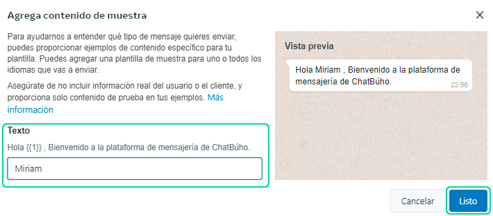

# Plantillas de mensajes

Las plantillas de mensajes son modelos de mensajes que pueden ser utilizados para enviar un mensaje por WhatsApp a un cliente que no se ha puesto en contacto antes con su empresa o que tiene más de 24 horas sin responder a un chat existente.

Esta opción ha sido creada para evitar que los clientes reciban mensajes de spam de las empresas y para mantener el elevado valor de WhatsApp como canal de interacción entre los clientes y las empresas. Esta es la razón por la que los modelos de Mensajes deben ser aprobados previamente.

Para comprender bien el funcionamiento de los modelos de mensajes, es necesario comprender el funcionamiento de la [“Ventana temporal de 24 horas“](https://www.whatsapp.com/legal/business-policy/?lang=es). Esta ventana corresponde a un periodo de tiempo de 24 horas que empieza en el momento que el cliente se pone en contacto con la empresa a través de WhatsApp o responde a una plantilla enviada por la empresa. Durante estas 24 horas, WhatsApp permite a la empresa comunicarse con el cliente con mensajes de sesión (es decir, permite a la empresa escribir libremente al cliente utilizando texto, imágenes, documentos, etc.).

**Transcurridas las 24 horas desde el último mensaje del cliente (o si el cliente nunca se ha puesto en contacto con su empresa), será necesario utilizar una plantilla de mensaje que debe ser aprobada previamente por WhatsApp.**

## Requisitos
* La plantilla de mensaje debe aprobarse antes de poder usarla para iniciar una conversación.
* Para poder comenzar una conversación iniciada por la empresa, es necesario que el cliente haya aceptado recibir mensajes de tu empresa.

:::danger IMPORTANTE:

A partir del 1 de Junio del 2023, se cambiarán las categorías, por favor revisar el **[artículo](../whatsapp-api-facebook/Actualizaciones-de-precios-basados%20-en-conversaciones-WhatsApp-API-a-partir-del-1-de-Abril-de-2023.md).**

:::

## Categorías de plantillas admitidas
* **Marketing:** envía ofertas promocionales, novedades de productos y más con el objetivo de incrementar el reconocimiento y la interacción.
* **Autenticación:** envía códigos que permiten a los clientes acceder de manera segura a sus cuentas.
* **Servicios públicos/Utilidad:** envía actualizaciones relacionadas con la cuenta y con los pedidos, alertas, etc, con el objetivo de compartir información importante.

## Agrega muestras en tu plantilla de mensaje
**Te recomendamos que agregues una muestra antes de enviar la plantilla para su aprobación.** Las muestras te permiten proporcionar los activos multimedia y los valores de texto de muestra relacionados con las variables de texto o el contenido multimedia que requiere tu plantilla. De esta manera, la tarea de visualizar el modo en que los clientes verán tu plantilla es más sencilla.

Además, si se rechaza la plantilla que enviaste y decides apelar, será necesario, de todos modos, que incluyas una muestra en tu apelación. Por este motivo, es mejor incluir una desde el inicio.

Para incluir una muestra en el envío, primero crea la plantilla, agrega las variables necesarias y, luego, haz clic en el botón **"Agregar Muestra"** 

En el panel de vista previa verás los activos multimedia o los valores de texto de muestra que proporcionaste. Finalmente selecciona el botón **"Listo"** y envia la plantilla para su aprobación.

## Guía paso a paso en video

<iframe width="100%" height="505" src="https://www.youtube.com/embed/HdmZBUs1abc" title="YouTube video player" frameborder="0" allow="accelerometer; autoplay; clipboard-write; encrypted-media; gyroscope; picture-in-picture; web-share" allowfullscreen="allowfullscreen"></iframe>

