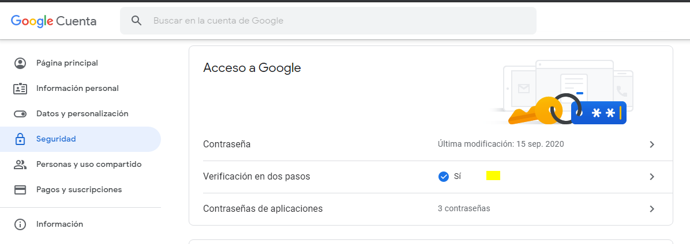
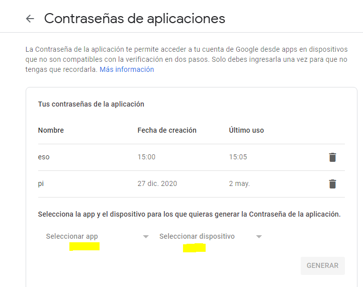
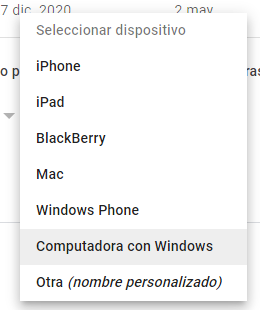
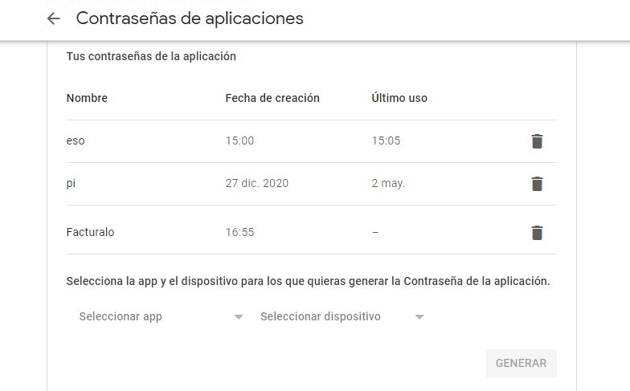

# Correo electronico emisor - Cliente

**Docker | LAMP**

### Requisitos previos

1. En la cuenta de Google, accede al apartado de [seguridad](https://myaccount.google.com/) y luego a la sección de Verificación de dos pasos.

2. Después de activarlo, crea una contraseña de aplicaciones.

3. Este apartado, generará una contraseña para que se pueda acceder desde otros dispositivos, se recomienda generarla al momento que se va insertar en el sistema ya que es recomendable no usar la contraseña para otras aplicaciones.

### Generación de contraseña de aplicaciones

1. Selecciona la aplicación, en nuestro caso, Correo electrónico.

2. Para el dispositivo, selecciona "Otra" y nómbralo (Facturalo).

3. Genera la contraseña de aplicación.

4. Copia la contraseña generada en el recuadro amarillo en el apartado de contraseña.

5. COn esto, ya tenemos generada la contraseña de la aplicacion.

### Notas adicionales

- Es posible eliminar la contraseña de aplicación si no se desea usar, sin necesidad de cambiar la contraseña de la cuenta principal.
- Si las credenciales son correctas y aún no envía correo, desbloquea el acceso de aplicaciones mediante el enlace [DisplayUnlockCaptcha](https://accounts.google.com/DisplayUnlockCaptcha).

