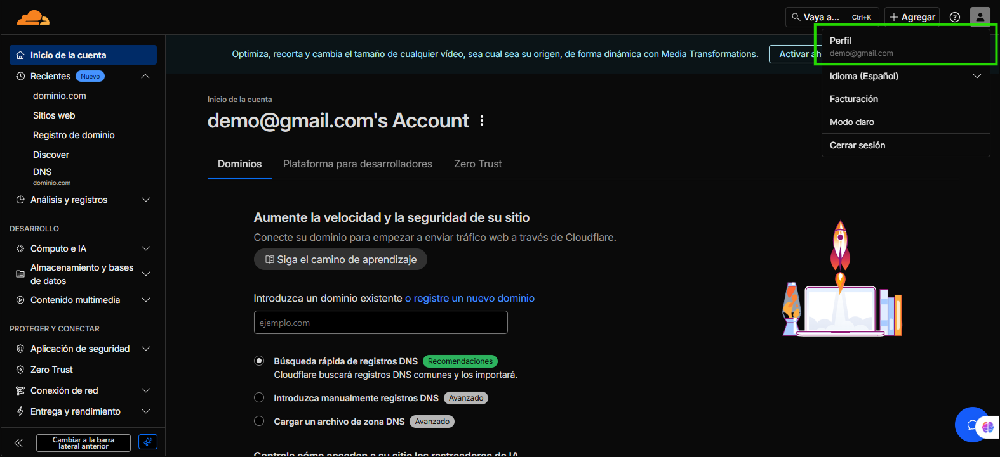
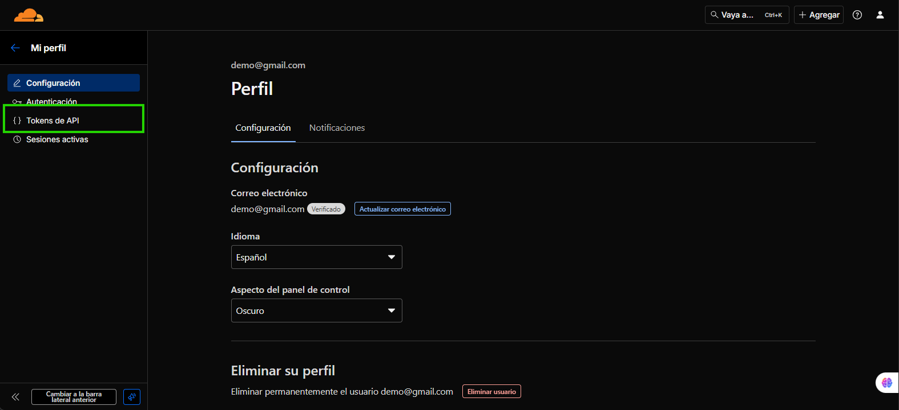
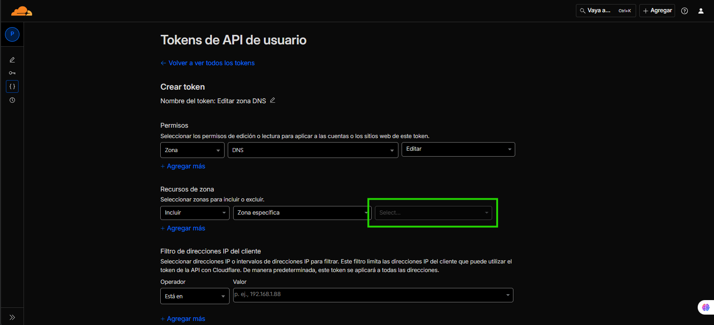
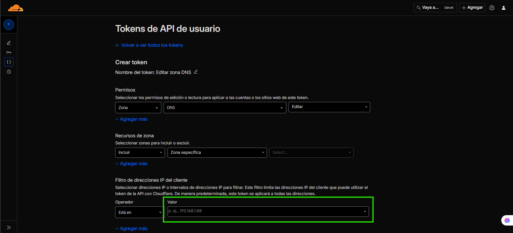
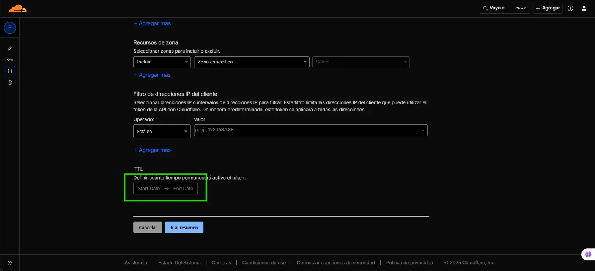

# 🌐 Configuración SSL con Cloudflare + Certbot + Docker

Este documento detalla el proceso para generar y renovar certificados
SSL con **Let's Encrypt (Certbot)** usando el plugin **Cloudflare DNS**,
aplicarlos a tu contenedor Docker y automatizar su renovación.

------------------------------------------------------------------------

## 📋 Prerequisitos

Antes de comenzar, asegúrate de tener:

1. **API Token de Cloudflare** con permisos de edición de DNS
   - [Ver cómo obtener tu token de Cloudflare →](configuracion_ssl_cloudflare#-anexo-obtener-token-cloudflare)
2. Acceso SSH a tu servidor
3. Docker y Docker Compose instalados
------------------------------------------------------------------------

## 🧩 1. Instalación de dependencias

``` bash
sudo apt install -y python3-certbot-dns-cloudflare
sudo apt install -y cron
```

------------------------------------------------------------------------

## ⚙️ 2. Archivo de configuración Cloudflare

Creamos el archivo de credenciales:

``` bash
sudo nano /etc/letsencrypt/<dominio>_cloudflare.ini
```

Contenido del archivo:

    dns_cloudflare_api_token = $CLOUDFLARE_TOKEN

> ⚠️ Protege el archivo para que solo root pueda leerlo:

``` bash
sudo chmod 600 /etc/letsencrypt/<dominio>_cloudflare.ini
```

------------------------------------------------------------------------

## 🔐 3. Generar el certificado SSL

Ejecuta el siguiente comando reemplazando las variables por tu dominio y
correo:

``` bash
sudo certbot certonly   --dns-cloudflare   --dns-cloudflare-credentials /etc/letsencrypt/<dominio>_cloudflare.ini   -d <dominio> -d "*.<dominio>"   --agree-tos --no-eff-email   --server https://acme-v02.api.letsencrypt.org/directory   -m <your.email@example.com>
```

Esto generará los certificados en `/etc/letsencrypt/live/<dominio>/`.

------------------------------------------------------------------------

## 📂 4. Copiar los certificados

``` bash
sudo cp /etc/letsencrypt/live/<dominio>/privkey.pem <ruta>/certs/<dominio>.key
sudo cp /etc/letsencrypt/live/<dominio>/fullchain.pem <ruta>/certs/<dominio>.crt
```

------------------------------------------------------------------------

## 🧰 5. Aplicar cambios dentro del contenedor
``` bash
docker-compose exec -T fpm_<contenedor-servicio> php artisan config:cache
docker-compose exec -T fpm_<contenedor-servicio> php artisan cache:clear
```

> 💡 **Tip**: Si desconoces el nombre del contenedor-servicio, ejecuta el siguiente comando dentro de la carpeta del facturador:
>
> ``` bash
> docker-compose config --services
> ```
>
> Esto te mostrará la lista de servicios disponibles. Busca el que comience con `fpm_`.

------------------------------------------------------------------------

## 🔁 6. Reiniciar el proxy

``` bash
docker restart proxy_proxy_1
```

------------------------------------------------------------------------

## ⏰ 7. Automatizar la renovación con CRON

Agrega la tarea para renovar el certificado cada día a las 3 AM:

``` bash
(sudo crontab -l 2>/dev/null; echo "0 3 * * * certbot renew --quiet && docker restart proxy_proxy_1") | sudo crontab -
```

------------------------------------------------------------------------

## 🧠 8. Prueba de renovación (opcional)

Puedes verificar que todo esté correcto ejecutando una simulación:

``` bash
sudo certbot renew --dry-run
```

------------------------------------------------------------------------

## ✅ Resultado esperado

-   Certificados SSL emitidos y almacenados correctamente.
-   Renovación automática configurada.
-   Proxy Docker reiniciado automáticamente tras cada renovación.

------------------------------------------------------------------------

## 📎 Anexo: Obtener Token Cloudflare

Para crear tu API Token en Cloudflare:

1. Ingresa a tu cuenta de [Cloudflare](https://dash.cloudflare.com/)

2. Haz clic en tu icono de usuario (esquina superior derecha) → **"Mi Perfil"**

   

3. Ve a la sección **"Tokens de API"**

   

4. Haz clic en **"Crear token"**

   

5. Usa la plantilla **"Editar zona DNS"** y configura los siguientes permisos:

   

   - **Permisos**: `Zona` → `DNS` → `Editar`
   
6. En **"Recursos de zona"**:
   - Selecciona: `Incluir` → `Zona específica` → Elige tu dominio

   

7. En **"Filtro de direcciones IP del cliente"**:
   - **Operador**: Selecciona `Está en`
   - **Valor**: Ingresa la IP de tu servidor VPS donde está instalado el facturador

   

8. En **"TTL"** (Tiempo de vida del token):
   - Define las fechas de inicio y finalización del token según tus necesidades

   

9. Haz clic en **"Continuar al resumen"** y luego **"Crear token"**

10. **Copia el token generado** y guárdalo inmediatamente

> ⚠️ **Importante**: Guarda el token en un lugar seguro. No podrás verlo nuevamente después de cerrar esta ventana.