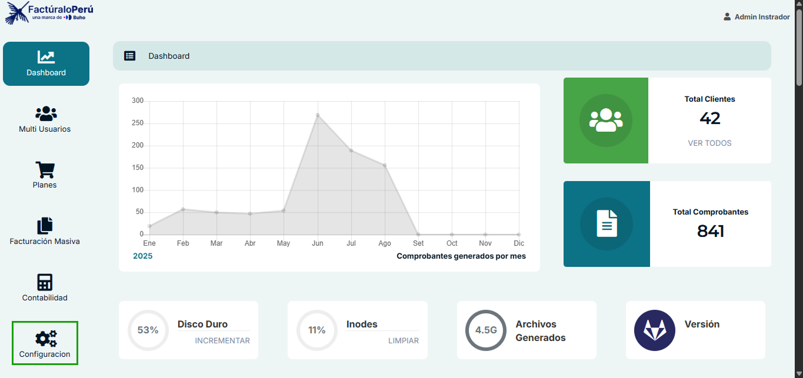
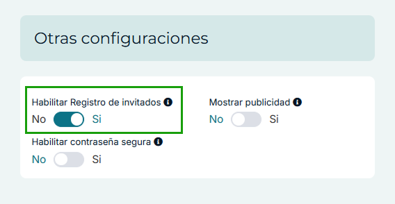
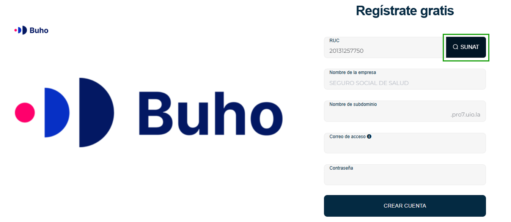
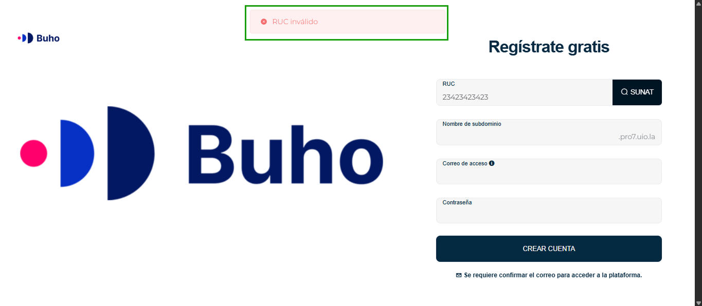
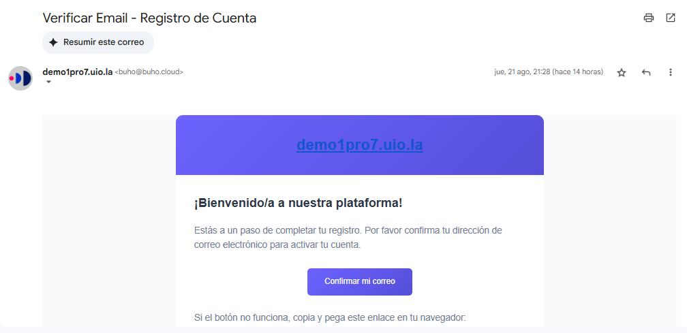
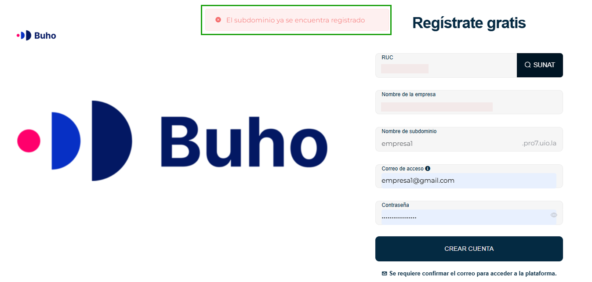
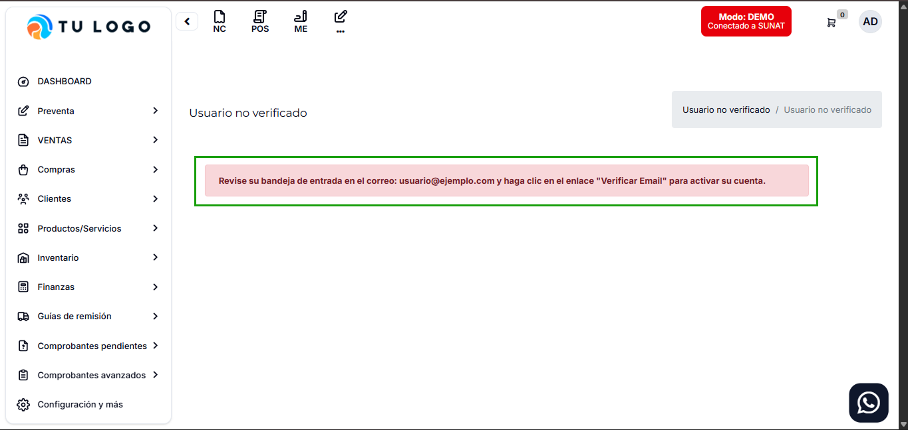

# Guest Register 
## Función de Auto-Registro de Invitados

### Descripción General

La función **Guest Register** es una nueva característica del sistema PRO 7.1 que permite a nuevos usuarios registrarse automáticamente en el sistema sin necesidad de intervención directa del administrador. Esta funcionalidad es ideal para sistemas de afiliación o esquemas de autogestión donde se requiere un proceso de registro más ágil.

### Características Principales

- **Registro automático**: Los usuarios pueden crear sus cuentas de forma independiente
- **Configuración flexible**: El administrador puede habilitar o deshabilitar esta función según sus necesidades
- **Validación de datos**: Requiere información empresarial válida para el registro
- **Sistema de verificación**: Incluye proceso de verificación por correo electrónico

---

## Configuración del Administrador

   - Navegar a: `Configuración` 

   

### Habilitar/Deshabilitar Guest Register

1. **Acceso a configuración**:
   - Navegar a: `Configuración` → `Otras configuraciones`
   
2. **Localizar la opción**:
   - Buscar: **"Habilitar Registro de invitados"**

   
   
3. **Estados disponibles**:
   - **Activado (Sí)**: Muestra el formulario de auto-registro en la página pública
   - **Desactivado (No)**: Oculta la opción de registro y muestra mensaje informativo

### URLs de acceso

- **Registro habilitado**: `{tu-dominio}/guest-register`
- **Registro deshabilitado**: `{tu-dominio}/guest-register/disabled`

*Ejemplo*: `https://demo.tusistema.com/guest-register`

---

## Proceso de Registro para Usuarios

### Requisitos Previos

Para completar el registro exitosamente, los usuarios deben contar con:

- **RUC válido y existente**: No se aceptan RUCs de prueba o inexistentes
- **Correo electrónico activo**: Debe ser una dirección de correo válida y operativa
- **Información empresarial**: Datos correctos de la empresa a registrar

### Formulario de Registro

El formulario de auto-registro incluye los siguientes campos:

1. **RUC**: Número de registro único de contribuyente de la empresa
2. **Nombre de subdominio**: Identificador único para el acceso al sistema
3. **Correo de acceso**: Dirección de correo electrónico principal
4. **Contraseña**: Clave de acceso inicial

### Proceso Paso a Paso

1. **Acceder al formulario**:
   - Visitar la URL: `{dominio-sistema}/guest-register`
   - Verificar que aparezca "Regístrate gratis"

2. **Completar información**:
   - Ingresar RUC empresarial válido
   - Definir nombre de subdominio
   - Proporcionar correo electrónico activo
   - Crear contraseña segura

3. **Envío del formulario**:
   - Hacer clic en "CREAR CUENTA"
   - El sistema validará la información proporcionada

4. **Verificación por correo**:
   - Revisar bandeja de entrada del correo proporcionado
   - Buscar mensaje de verificación del sistema
   - Hacer clic en el enlace "Verificar Email"

5. **Activación de cuenta**:
   - Una vez verificado el correo, la cuenta quedará activa
   - Podrá acceder al sistema con las credenciales creadas

---

## Estados del Sistema

### Cuando está Habilitado

- **Página visible**: Muestra formulario completo de registro
- **Título**: "Regístrate gratis"
- **Funcionalidad**: Permite completar el proceso de registro
- **Botón**: "CREAR CUENTA" activo

### Cuando está Deshabilitado

- **Mensaje informativo**: "Registro de invitados"
- **Descripción**: "El registro de invitados no está habilitado en este momento. Por favor, contacte al administrador para más información."
- **Acción disponible**: "VOLVER AL INICIO"
- **Estado**: No permite crear nuevas cuentas

---

## Validaciones y Restricciones

### Datos Empresariales

- **RUC obligatorio**: Debe existir en registros oficiales
- **Verificación automática**: El sistema valida la existencia del RUC

- **Campo autocompletado**: Una vez validado el RUC con la opción **SUNAT**, el sistema añadirá automáticamente un nuevo campo al formulario:
  - **Nombre de la empresa**  
  - Este campo se completa con la información oficial obtenida de SUNAT y **no puede ser editado ni modificado** por el usuario.

- **Rechazo de pruebas**: No acepta números de RUC de prueba o ficticios

### Correo Electrónico

- **Formato válido**: Debe cumplir con estándares de direcciones de correo
- **Correo activo**: Debe ser una dirección operativa que reciba mensajes
- **Verificación requerida**: Sin verificación no se puede acceder al sistema

### Subdominio

- **Unicidad**: No puede repetirse con subdominios existentes

- **Formato**: Debe cumplir con convenciones de nombres de dominio

---

## Proceso de Verificación

### Notificación por Correo

Una vez completado el registro, el sistema:

1. Envía correo de verificación automáticamente
2. Incluye enlace único de verificación

### Estado de Usuario No Verificado

- **Acceso limitado**: No puede utilizar funciones del sistema
- **Mensaje de alerta**: "Usuario no verificado"
- **Instrucciones**: "Revise su bandeja de entrada en el correo: usuario@ejemplo.com y haga clic en el enlace 'Verificar Email' para activar su cuenta"

### Activación Exitosa

- **Acceso completo**: Usuario puede utilizar todas las funciones disponibles
- **Estado actualizado**: Cambia a "Usuario verificado"
- **Sesión activa**: Puede iniciar sesión normalmente

---

## Casos de Uso Recomendados

### Sistemas de Afiliación

- **Registro masivo**: Permite que múltiples afiliados se registren sin intervención manual
- **Autogestión**: Reduce carga administrativa del sistema principal
- **Escalabilidad**: Facilita crecimiento del número de usuarios

### Autogestión Empresarial

- **Registro independiente**: Empresas pueden registrarse cuando lo requieran
- **Proceso ágil**: Reduce tiempos de espera para activación
- **Control distribuido**: Menos dependencia del administrador principal

---

## Consideraciones de Seguridad

### Validación de Datos

- **Verificación de RUC**: Previene registros con información falsa
- **Confirmación de correo**: Asegura que el usuario tenga acceso al email registrado
- **Contraseñas seguras**: Implementa políticas de contraseñas robustas

### Control de Acceso

- **Estados configurables**: El administrador mantiene control total sobre la función
- **Desactivación inmediata**: Puede deshabilitar registros cuando sea necesario
- **Monitoreo**: Posibilidad de revisar registros pendientes y completados

---

## Troubleshooting

### Problemas Comunes

**Error: RUC no válido**
- *Causa*: RUC inexistente o de prueba
- *Solución*: Verificar RUC en registros oficiales y usar número válido

**No recibo correo de verificación**
- *Causa*: Correo incorrecto o en spam
- *Solución*: Verificar dirección de correo y revisar carpeta de spam

**Registro deshabilitado**
- *Causa*: Administrador ha desactivado la función
- *Solución*: Contactar al administrador del sistema

**Subdominio no disponible**
- *Causa*: Nombre ya en uso
- *Solución*: Elegir un nombre de subdominio diferente

### Soporte Técnico

Para problemas adicionales:
- Contactar al administrador del sistema
- Verificar configuración de correo electrónico
- Revisar conectividad de red
- Validar información empresarial

