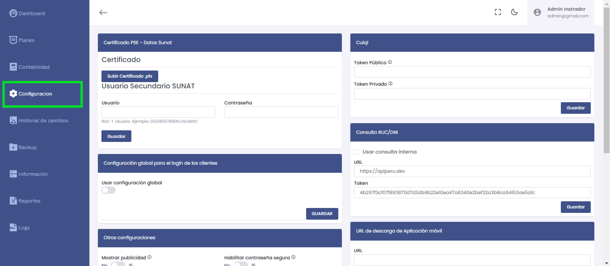
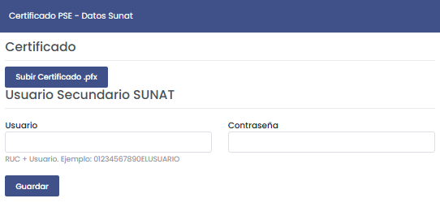
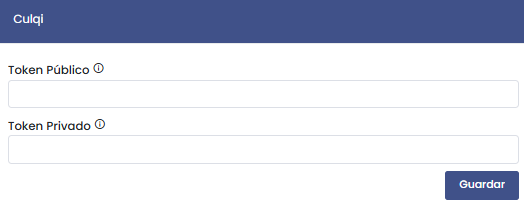
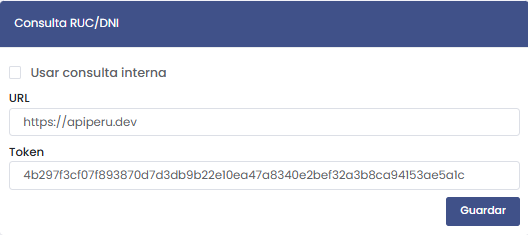
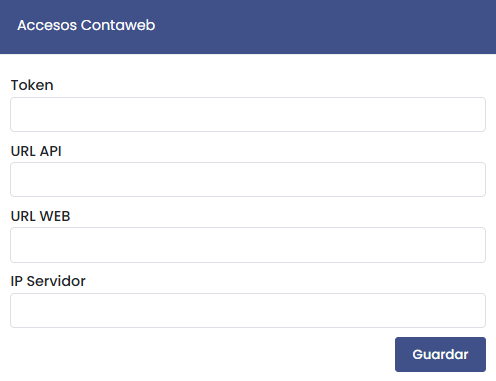
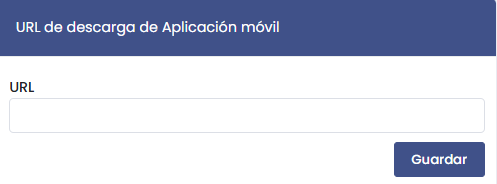

# Configuración

En esta sección se administran los ajustes generales del sistema, los accesos a servicios externos, y otras configuraciones relevantes para el funcionamiento de la plataforma.

---

## Certificado PSE – Datos SUNAT

Esta opción permite cargar el **certificado .pfx** necesario para la integración con SUNAT y configurar un usuario secundario para los servicios tributarios.

### Opciones:
- **Subir Certificado .pfx:** Carga el certificado digital.
- **Usuario Secundario SUNAT:**  
   - **Usuario:** Ingresa el usuario con formato RUC + Usuario (Ejemplo: 12345678901ELUSUARIO).  
   - **Contraseña:** Ingresar la contraseña asociada.  
- **Guardar:** Almacena las credenciales ingresadas.

---

## Configuración Global para el Login de los Clientes

Esta sección permite definir si se aplicarán configuraciones globales para el acceso de los clientes, personalizando tanto la apariencia como los elementos mostrados en el formulario de inicio de sesión.

### Opciones Disponibles:

1. **Usar configuración global:**  
   - Activa o desactiva los ajustes globales que aplicarán a todos los clientes.

2. **Cambiar Imagen de Fondo:**  
   - Permite seleccionar una imagen de fondo personalizada para el formulario.  
   - **Recomendación:** Se sugiere una imagen de **747 x 547 px** en formato **PNG** o **SVG** con fondo transparente.

3. **Vista Previa:**  
   - Muestra cómo quedará la imagen seleccionada en el fondo del formulario.

4. **Cambiar Logo:**  
   - Opción para subir un logo personalizado que se mostrará en el formulario de login.  
   - **Recomendación:** Tamaño sugerido de **700 x 300 px** en formato **PNG**.

5. **Posición del Formulario:**  
   - Define la ubicación del formulario en la pantalla:  
     - **Opciones:** Derecha, Izquierda, Centro.

6. **Mostrar Logo en el Formulario:**  
   - Activa o desactiva la visualización del logo dentro del formulario.

7. **Posición del Logo de la Empresa:**  
   - Determina dónde se colocará el logo dentro del formulario:  
     - **Opciones:** Superior izquierda, Superior derecha, Centro.

8. **Mostrar Botones de Redes Sociales:**  
   - Permite activar botones con enlaces a las redes sociales del cliente.

9. **Redes Sociales Disponibles:**  
   - **Facebook:** Ingresa la URL del perfil o página de Facebook.  
   - **Twitter:** Ingresa la URL del perfil de Twitter.  
   - **Instagram:** Ingresa la URL del perfil de Instagram.  
   - **LinkedIn:** Ingresa la URL del perfil de LinkedIn.

10. **Guardar Cambios:**  
   - Una vez configurados todos los parámetros, haz clic en **Guardar** para aplicar los cambios.

---

### Ejemplo de Uso:

1. Subir un logo de 700 x 300 px en PNG.
2. Seleccionar la posición **Derecha** para el formulario.
3. Activar el botón de redes sociales y añadir enlaces a Facebook e Instagram.
4. Finalmente, hacer clic en **Guardar** para confirmar las configuraciones.

---

Esta sección garantiza que los clientes tengan una experiencia personalizada al acceder al sistema, permitiendo que las empresas reflejen su identidad visual y mejoren la experiencia de usuario desde el inicio de sesión.

## CULQI – Configuración de Pagos

Permite configurar los **tokens de CULQI** para procesar pagos en línea.

- **Token Público:** Llave pública proporcionada por CULQI.
- **Token Privado:** Llave privada para la integración con CULQI.
- **Guardar:** Almacena los tokens ingresados.

---

## Consulta RUC/DNI

Integra el sistema con un servicio externo para consultas de RUC y DNI.

- **Usar consulta interna:** Activa la opción para usar consultas internas.  
- **URL:** Dirección del servicio API para consultas.  
- **Token:** Llave de acceso a la API.  
- **Guardar:** Almacena la configuración.

---

## Otras Configuraciones

En esta sección se gestionan opciones adicionales del sistema.

- **Mostrar publicidad:** Activa o desactiva la visualización de anuncios.
- **Habilitar contraseña segura:** Habilita el uso de contraseñas seguras.
- **Mostrar manual de usuario:** Activa la opción para mostrar un manual de usuario.
- **URL manual de usuario:** Dirección web del manual (Ejemplo: [Manual](https://fastura.github.io/documentacion/)).

---

## Acceso ContaWeb

Configura los accesos para la integración con ContaWeb.

- **Token:** Llave de autenticación para el acceso a ContaWeb.
- **URL API:** Dirección del servicio API de ContaWeb.
- **URL WEB:** Enlace de la página web de ContaWeb.
- **IP Servidor:** Dirección IP del servidor asociado a ContaWeb.
- **Guardar:** Almacena la configuración ingresada.

---

## URL de Descarga de Aplicación Móvil

Configura la dirección para la descarga de la aplicación móvil.

- **URL:** Enlace directo a la descarga de la app.
- **Guardar:** Almacena la URL configurada.

---

Esta sección permite mantener centralizados los accesos y ajustes clave del sistema, garantizando un funcionamiento adecuado e integraciones seguras con servicios externos.
