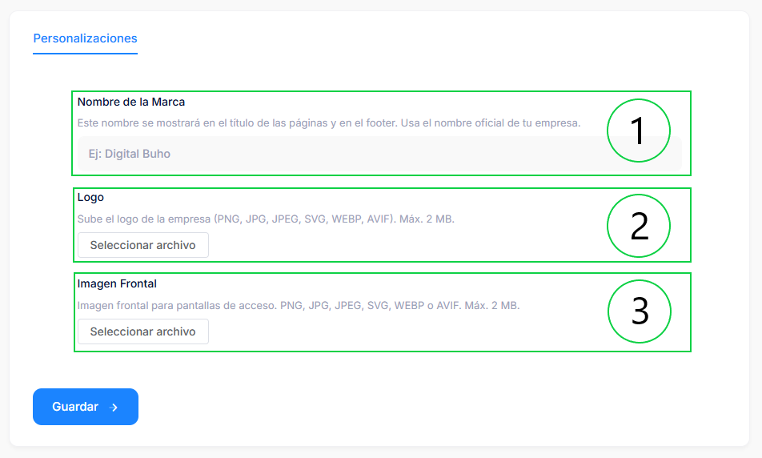
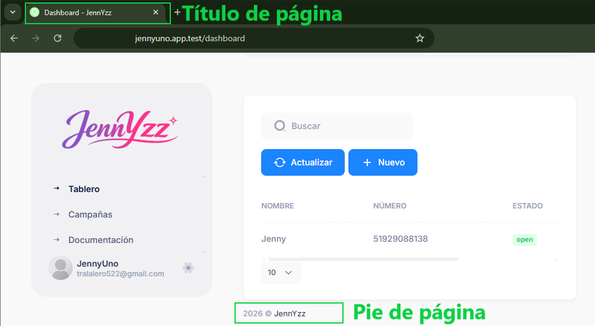
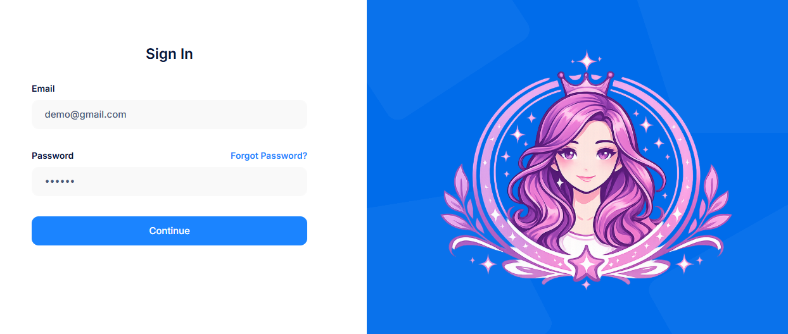
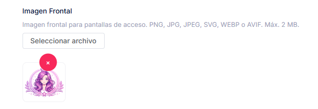

# Personalización

Esta sección permite al **reseller** definir y aplicar su propia identidad de marca de forma centralizada. Las configuraciones que realice aquí se propagarán automáticamente a **todos los clientes** que cree, actuando como una **marca de agua** o branding heredado.

De esta manera, cada cliente creado por el reseller llevará la apariencia y el nombre de marca del reseller.

:::tip Propósito principal
El reseller sube su marca una sola vez → todos sus clientes heredan automáticamente:
- Nombre de marca en títulos y footer
- Logo en el dashboard
- Imagen frontal en login/register (tanto del cliente como del propio reseller)
:::

## Campos de Customizations

### 1. Nombre de Marca

**Descripción**  
Nombre oficial del reseller o de la marca que se quiere imponer a todos los clientes asociados.

**Dónde aparece**  

- En el **título de cada página** (pestaña del navegador) de todos los clientes del reseller  
- En el **pie de página (footer)** de todas las páginas de los clientes  
- También en las páginas del propio reseller (login, dashboard, etc.)

**Instrucciones**  

- Ingresa el nombre comercial o legal completo  
- Recomendado: máximo 80–100 caracteres para evitar cortes  
- Ejemplo: `Soluciones Digitales Pro – Tu Marca`

:::note Comportamiento
Si el reseller no configura nada, se usa un valor por defecto del sistema.
:::

### 2. Logo (Logo de la Marca del Reseller)

**Descripción**  
Logo principal que identifica al reseller y que se mostrará en todos los clientes que administre.

**Dónde aparece**  

- En el **dashboard** principal de cada cliente 
- También en el dashboard del propio reseller

**Requisitos técnicos**

- Formatos: PNG, JPG, JPEG, SVG, WEBP, AVIF  
- Tamaño máximo: **2 MB**  
- Recomendado: 200 × 200 px o formato horizontal, preferible fondo transparente

**Instrucciones**  

1. Sube el archivo  
2. Puedes reemplazarlo cuando hagas rebranding o simplemente dejarlo vacío

:::tip Recomendaciones para el logo
- Usa versión con fondo transparente para mejor integración  
- Alta resolución evita pixelación en diferentes dispositivos  
- Mantén simplicidad para que se vea bien en tamaños pequeños
:::

### 3. Front Image (Imagen Frontal / Fondo de Autenticación)

**Descripción**  
Imagen visual que refuerza la identidad del reseller en las pantallas de acceso.

**Dónde aparece**  

- Página de **Login** de todos los clientes  
- Página de **Register** de todos los clientes  
- Las mismas páginas del **propio reseller** (experiencia coherente)

**Requisitos técnicos**

- Formatos: PNG, JPG, JPEG, SVG, WEBP, AVIF  
- Tamaño máximo: **2 MB**  
- Recomendado: 1920 × 1080 px (panorámica, alta calidad)

**Instrucciones**  

1. Sube la imagen deseada  
2. Reemplaza cuando sea necesario (rebranding, cambio estacional, etc.)

:::warning Importante para legibilidad
Elige imágenes que no interfieran con la lectura de los formularios (usuario, contraseña, botones).  
Evita fondos muy claros, muy oscuros o con mucho detalle en las zonas donde va el texto.
:::

## Consideraciones Generales

- **Quién puede configurar**  
  Solo usuarios con rol de **reseller** (o super-admin con permisos) acceden a esta sección.

- **Propagación automática**  
  Una vez guardados los cambios, se aplican inmediatamente a:  
  - El propio panel del reseller  
  - **Todos los clientes** ya creados  
  - Cualquier **nuevo cliente** que se cree en el futuro

- **clientes finales**  
  En la mayoría de los casos, los clientes no ven ni pueden modificar estas customizaciones (funciona como branding impuesto / white-label desde el reseller).

- **Validaciones del sistema**  
  - Archivos > 2 MB → rechazados  
  - Formato no permitido → mensaje de error claro

- **Solución de problemas comunes**

  | Problema                              | Posible causa / solución                              |
  |---------------------------------------|-------------------------------------------------------|
  | Imagen no aparece en algún cliente     | Limpia caché del navegador · Verifica propagación     |
  | Nombre de marca no se actualiza       | Recarga la página · Confirma que se guardó el cambio  |
  | Error al subir archivo                | Tamaño > 2 MB o formato inválido                      |

:::info Rebranding futuro
Si cambias de marca (nuevo logo, nombre, imagen), solo actualiza aquí una vez y todos tus clientes reflejarán la nueva identidad automáticamente.  
Es la ventaja principal del modelo reseller → centralización del branding.
:::
